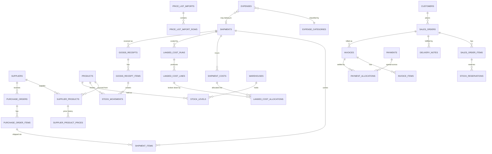

# Data Model

Legend: ✅ exists today · ➕ existing table, columns added · 🆕 new table

Money columns always appear as a group: `*_amount numeric(19,4)`, `currency char(3)`,
`exchange_rate numeric(19,8)`, `*_base_amount numeric(19,4)`. Written below as
**`money(x)`** for brevity.

All tables carry `id bigserial`, `created_at`, `updated_at` unless noted.

---

## 1. High-level map



---

## 2. System & configuration

### 🆕 `companies`
Single row in v1; the hook for multi-company later.

| Column | Type | Notes |
|---|---|---|
| name, legal_name | varchar | |
| tax_number, registration_number | varchar null | |
| address, city, country | varchar/text | |
| phone, email, website | varchar null | |
| logo_path, stamp_path | varchar null | Used on PDFs |
| base_currency | char(3) | `USD` |
| fiscal_year_start_month | smallint | default 1 |
| settings | jsonb | invoice terms, defaults |

### ✅ `branches` · ✅ `settings` · ✅ `users` · ✅ spatie `permission_tables` · ✅ `activity_log`

➕ `users`: add `locale` (`en`/`ar`/`ku`), `avatar_path`, `last_login_at`, `last_login_ip`,
`theme_preference` (`system`/`light`/`dark`).

### 🆕 `currencies`

| Column | Type | Notes |
|---|---|---|
| code | char(3) PK | `USD`, `CNY`, `IQD` |
| name, symbol | varchar | |
| decimal_places | smallint | USD 2, CNY 2, IQD 0 |
| symbol_position | varchar | before / after |
| is_base, is_active | boolean | exactly one base |

### 🆕 `exchange_rates`

| Column | Type | Notes |
|---|---|---|
| from_currency, to_currency | char(3) | |
| rate | numeric(19,8) | |
| effective_date | date | |
| source | varchar | `manual` / `api` |
| created_by | fk users null | |

**Unique** `(from_currency, to_currency, effective_date)`.
Lookup = latest rate with `effective_date <= document date`.

### 🆕 `number_sequences`

| Column | Type | Notes |
|---|---|---|
| document_type | varchar | `purchase_order`, `invoice`, `shipment`… |
| year | smallint | |
| prefix | varchar | `PO` |
| format | varchar | `{prefix}-{year}-{number}` |
| padding | smallint | 4 |
| next_number | integer | |

**Unique** `(document_type, year)`. Allocated under `SELECT … FOR UPDATE`.

### 🆕 `attachments` *(or spatie `media`)*
Polymorphic file store: `attachable_type/id`, `disk`, `path`, `original_name`, `mime`,
`size`, `category` (`contract`, `bl`, `customs`, `invoice`, `photo`), `uploaded_by`.

---

## 3. Catalog

### ➕ `product_categories` ✅
Add: `parent_id` (self-FK, nested set or adjacency), `slug`, `description`, `image_path`,
`default_hs_code`, `default_duty_rate numeric(5,2)`, `sort_order`, `is_active`.

### 🆕 `brands`
`name`, `slug`, `logo_path`, `notes`, `is_active`.

### ➕ `units` ✅
Add: `code`, `symbol`, `is_base`, `precision smallint` (0 for pcs, 3 for metres/kg).

### 🆕 `product_groups`
Groups variants of one model. `name`, `product_category_id`, `notes`.

### ➕ `products` ✅ — the most extended table

Existing: `sku`(uniq), `barcode`, `name`, `description`, `product_category_id`, `unit_id`,
`cost_price`, `selling_price`, `tax_rate`, `reorder_level`, `track_stock`, `is_active`.

**Added:**

| Column | Type | Purpose |
|---|---|---|
| name_ar, name_ku, name_zh | varchar null | **`name_zh` matters** — it's how you talk to Chinese suppliers on WeChat |
| slug | varchar uniq | |
| brand_id | fk null | |
| product_group_id | fk null | Variant grouping (rec. ⑫) |
| attributes | jsonb | `{"color":"Gold","size":"80cm","material":"K9 crystal"}` — GIN indexed |
| base_unit_id | fk units | Unit stock is held & sold in |
| purchase_unit_id | fk units null | e.g. Carton |
| pack_size | numeric(15,4) default 1 | Base units per purchase unit (rec. ⑤) |
| weight_kg | numeric(12,4) | Per base unit |
| volume_cbm | numeric(14,6) | Per base unit — drives freight allocation |
| carton_length_cm / width / height | numeric(10,2) null | |
| units_per_carton | numeric(15,4) null | |
| hs_code | varchar null | Customs tariff code (rec. ⑬) |
| duty_rate | numeric(5,2) null | Falls back to category default |
| country_of_origin | char(2) default `CN` | |
| default_supplier_id | fk suppliers null | |
| average_cost | numeric(19,4) | **Moving weighted-average landed cost, base currency** |
| last_landed_cost | numeric(19,4) | Most recent receipt's landed unit cost |
| standard_cost | numeric(19,4) null | Manual benchmark for quoting |
| selling_price_currency | char(3) | |
| min_selling_price | numeric(19,4) null | Guard-rail; warns Sales below this |
| target_margin_percent | numeric(5,2) null | Drives suggested pricing |
| reorder_quantity | numeric(15,4) | |
| lead_time_days | smallint null | |
| is_sellable, is_purchasable | boolean | |
| status | varchar | `active` / `discontinued` / `draft` |
| internal_notes | text null | |

**Derived, not stored** (computed accessors / views): `stock_available`,
`stock_reserved`, `stock_incoming`, `gross_margin`, `margin_percent`.

**Indexes:** `sku`, `barcode`, `product_category_id`, `brand_id`, `default_supplier_id`,
`status`, GIN on `attributes`, trigram on `name` for fuzzy search.

### 🆕 `price_tiers`
`name` (Wholesale / VIP / Retail), `code`, `default_discount_percent`, `is_default`.

### 🆕 `product_prices`
Tiered & quantity-break pricing.

| Column | Type |
|---|---|
| product_id, price_tier_id | fk |
| currency | char(3) |
| price | numeric(19,4) |
| min_quantity | numeric(15,4) default 1 |
| valid_from, valid_to | date null |

**Index** `(product_id, price_tier_id, min_quantity)`.

### 🆕 `tags` + `taggables`
Free-form product tagging (polymorphic).

---

## 4. Supplier catalogue & price lists

### ➕ `suppliers` ✅

Existing: `code`, `name`, `contact_person`, `email`, `phone`, `address`, `tax_number`,
`payment_terms_days`, `opening_balance`, `is_active`, `notes`.

**Added:** `name_zh`, `whatsapp`, `wechat_id`, `country char(2)`, `city`, `website`,
`default_currency char(3)`, `default_incoterm` (`EXW`/`FOB`/`CIF`/`DDP`),
`port_of_loading`, `average_lead_time_days`, `rating smallint` (1–5),
`bank_details jsonb`, `deposit_percent numeric(5,2)` (typical), `is_active`.

### 🆕 `supplier_contacts`
`supplier_id`, `name`, `role`, `phone`, `whatsapp`, `wechat_id`, `email`, `is_primary`, `notes`.

### 🆕 `supplier_products` — recommendation ③, the linchpin of importing

| Column | Type | Notes |
|---|---|---|
| supplier_id, product_id | fk | |
| supplier_sku | varchar | **Their** code — what price lists match on |
| supplier_name | varchar null | Their product name |
| supplier_name_zh | varchar null | Chinese name |
| currency | char(3) | |
| unit_price | numeric(19,4) | Current quoted price |
| price_unit_id | fk units | Price is *per this unit* (per carton vs per piece) |
| moq | numeric(15,4) null | Minimum order quantity |
| pack_size | numeric(15,4) | Their carton size |
| lead_time_days | smallint null | |
| is_preferred | boolean | Default source for this product |
| last_quoted_at | date null | |
| notes | text null | |

**Unique** `(supplier_id, supplier_sku)`. **Index** `(product_id, is_preferred)`.

### 🆕 `supplier_product_prices` — price history

`supplier_product_id`, `currency`, `unit_price`, `effective_date`,
`source` (`manual`/`import`/`purchase_order`), `price_list_import_id` null,
`previous_price`, `change_percent`, `created_by`.

**Index** `(supplier_product_id, effective_date desc)`. Powers price-drift charts.

### 🆕 `import_profiles` — saved column mappings per supplier

`supplier_id`, `name`, `sheet_name`, `header_row smallint`, `first_data_row smallint`,
`column_map jsonb`, `currency`, `decimal_separator`, `thousands_separator`,
`price_unit_id`, `is_default`.

`column_map` example:
```json
{ "supplier_sku": "B", "name": "C", "name_zh": "D",
  "unit_price": "G", "moq": "H", "pack_size": "I", "cbm": "K", "weight": "L" }
```

### 🆕 `price_list_imports`

| Column | Type |
|---|---|
| supplier_id, import_profile_id null | fk |
| original_filename, stored_path, disk | varchar |
| status | `uploaded`/`mapping`/`parsing`/`previewed`/`committing`/`committed`/`failed`/`cancelled` |
| sheet_name, header_row | |
| column_map | jsonb |
| currency, effective_date | |
| rows_total / new / updated / unchanged / error | integer |
| avg_change_percent | numeric(6,2) |
| error_log | jsonb |
| imported_by, committed_at, reverted_at | |

### 🆕 `price_list_import_rows`

| Column | Type | Notes |
|---|---|---|
| price_list_import_id | fk | |
| row_number | integer | |
| raw | jsonb | Original cell values, kept for audit |
| supplier_sku, name, name_zh | varchar null | Parsed |
| currency, unit_price, moq, pack_size, cbm, weight | | Parsed |
| matched_product_id, matched_supplier_product_id | fk null | |
| match_method | `supplier_sku`/`barcode`/`sku`/`name_fuzzy`/`none` | |
| match_confidence | numeric(5,2) | |
| action | `create`/`update_price`/`unchanged`/`skip`/`error` | |
| old_price, new_price, change_percent | numeric | Drives the diff view |
| is_approved | boolean | Per-row approval in preview |
| errors | jsonb | |

**Index** `(price_list_import_id, action)`.

---

## 5. Purchasing

### ➕ `purchase_orders` ✅
Existing: `number`, `supplier_id`, `warehouse_id`, `order_date`, `expected_date`,
`status`, `subtotal`, `discount_total`, `tax_total`, `total`, `notes`, `created_by`.

**Added:** `currency`, `exchange_rate`, `base_total`, `incoterm`,
`supplier_reference` (their PI number), `deposit_percent`, `deposit_due_date`,
`balance_due_date`, `expected_ship_date`, `port_of_loading`, `payment_terms_days`,
`approved_by`, `approved_at`, `closed_at`.

**Status enum extended:** `draft → sent → confirmed → in_production → ready_to_ship →
partially_shipped → shipped → partially_received → received → closed | cancelled`.

### ➕ `purchase_order_items` ✅
**Added:** `supplier_product_id` fk null, `supplier_sku`, `description_override`,
`order_unit_id` + `pack_size` + `base_quantity` (rec. ⑤),
`shipped_quantity`, `received_quantity`, `unit_weight_kg`, `unit_volume_cbm`,
`hs_code`, `duty_rate`.

### ➕ `supplier_bills` ✅ / `supplier_payments` ✅
**Added to both:** `currency`, `exchange_rate`, `base_amount`, `bank_account_id`,
`fx_gain_loss numeric(19,4)` on payments (rec. ⑥).

### 🆕 `supplier_payment_allocations`
Mirror of the sales side: one payment across several bills.
`supplier_payment_id`, `supplier_bill_id`, `amount`, `base_amount`.

---

## 6. Shipments & logistics — entirely new

### 🆕 `freight_forwarders`
`name`, `code`, `contact_person`, `phone`, `email`, `country`, `notes`, `is_active`.

### 🆕 `shipments`

| Column | Type | Notes |
|---|---|---|
| number | varchar uniq | `SHP-2026-0014` |
| reference | varchar null | Forwarder's booking ref |
| freight_forwarder_id | fk null | |
| shipping_method | enum | `sea_fcl` / `sea_lcl` / `air` / `land` / `express` |
| container_number | varchar null | |
| container_type | varchar null | `20ft` / `40ft` / `40hq` |
| bl_number, seal_number | varchar null | Bill of Lading |
| port_of_loading, port_of_discharge | varchar null | |
| etd, atd, eta, ata | date null | Estimated/actual departure & arrival |
| customs_entry_number | varchar null | |
| customs_cleared_at | date null | |
| delivered_at | date null | |
| status | enum | `planning`/`booked`/`in_transit`/`arrived`/`customs`/`cleared`/`delivered`/`closed`/`cancelled` |
| landed_cost_status | enum | `none`/`estimated`/`actual`/`final` (rec. ②) |
| total_weight_kg | numeric(14,4) | Denormalised from items |
| total_volume_cbm | numeric(14,6) | Denormalised from items |
| total_goods_base | numeric(19,4) | |
| total_costs_base | numeric(19,4) | |
| tracking_url | varchar null | |
| warehouse_id | fk | Destination |
| notes | text null | |
| created_by | fk null | |

**Index** `(status, eta)`, `(landed_cost_status)`, `container_number`.

### 🆕 `shipment_items`
Links PO lines to a container, allowing **partial** quantities — one PO across two
containers, or many POs in one container.

| Column | Type |
|---|---|
| shipment_id | fk |
| purchase_order_item_id | fk null |
| product_id | fk |
| quantity | numeric(15,4) (base units) |
| unit_cost, currency, exchange_rate, unit_cost_base | money(unit_cost) |
| goods_value_base | numeric(19,4) — `quantity × unit_cost_base` |
| unit_weight_kg, unit_volume_cbm | numeric — snapshot from product at time of shipping |
| total_weight_kg, total_volume_cbm | numeric (generated) |
| hs_code, duty_rate | |
| customs_value_base | numeric(19,4) — declared value, may differ from goods value |
| received_quantity | numeric(15,4) |

### 🆕 `shipment_cost_types`

| code | default_allocation_basis | affects_landed_cost | is_duty |
|---|---|---|---|
| `sea_freight` | volume | ✔ | |
| `air_freight` | weight | ✔ | |
| `insurance` | value | ✔ | |
| `customs_duty` | per_line_hs | ✔ | ✔ |
| `clearance_agent` | value | ✔ | |
| `port_charges` | volume | ✔ | |
| `inland_transport` | volume | ✔ | |
| `inspection` | manual | ✔ | |
| `bank_charges` | value | ✔ | |
| `demurrage` | volume | ✔ | |
| `other` | value | ✔ | |

Editable — you can add cost types without a code change.

### 🆕 `shipment_costs`

| Column | Type | Notes |
|---|---|---|
| shipment_id | fk | |
| shipment_cost_type_id | fk | |
| description | varchar | |
| supplier_id / vendor_name | fk null / varchar | Who charged it |
| amount, currency, exchange_rate, base_amount | money | |
| allocation_basis | enum | `value`/`weight`/`volume`/`quantity`/`per_line_hs`/`manual`/`none` — defaulted from type, overridable |
| manual_allocations | jsonb null | `{shipment_item_id: amount}` when basis = manual |
| is_estimated | boolean | true until the real invoice arrives (rec. ②) |
| document_reference | varchar null | Their invoice number |
| expense_id | fk expenses null | Links to the cash-out record |
| incurred_at | date | |

### 🆕 `shipment_events` — timeline
`shipment_id`, `event`, `description`, `occurred_at`, `user_id`, `metadata jsonb`.
Drives the vertical timeline UI.

---

## 7. Landed cost engine

### 🆕 `landed_cost_runs`

| Column | Type | Notes |
|---|---|---|
| shipment_id | fk | |
| version | smallint | Runs are versioned, never overwritten |
| status | enum | `draft`/`applied`/`superseded` |
| basis_snapshot | jsonb | Costs & bases used — makes the run reproducible |
| total_goods_base, total_costs_base | numeric(19,4) | |
| total_weight_kg, total_volume_cbm, total_quantity | numeric | Denominators used |
| is_final | boolean | |
| calculated_at, applied_at | timestamp | |
| calculated_by | fk users | |
| notes | text | |

**Unique** `(shipment_id, version)`.

### 🆕 `landed_cost_lines`

| Column | Type |
|---|---|
| landed_cost_run_id, shipment_item_id, product_id | fk |
| quantity | numeric(15,4) |
| goods_value_base | numeric(19,4) |
| weight_kg, volume_cbm | numeric |
| allocated_costs_base | numeric(19,4) — sum of allocations |
| total_landed_base | numeric(19,4) — goods + allocated |
| landed_unit_cost | numeric(19,4) — **the number the business runs on** |
| previous_unit_cost | numeric(19,4) null |
| variance_amount, variance_percent | numeric |
| cost_uplift_percent | numeric(6,2) — how much % costs added over goods value |

### 🆕 `landed_cost_allocations`
Full breakdown so the UI can show "$4.12 freight + $1.80 duty + $0.35 clearance".

`landed_cost_line_id`, `shipment_cost_id`, `basis_used`, `basis_value`, `share_percent`,
`amount_base`.

### 🆕 `cost_revaluations` — recommendation ②

Raised when a shipment is finalised after stock has already moved.

| Column | Type |
|---|---|
| shipment_id, landed_cost_run_id | fk |
| product_id, warehouse_id | fk |
| quantity_on_hand, quantity_sold | numeric |
| old_unit_cost, new_unit_cost, unit_delta | numeric(19,4) |
| inventory_adjustment_base | numeric(19,4) — value change on remaining stock |
| cogs_adjustment_base | numeric(19,4) — correction to already-recorded COGS |
| status | `pending`/`applied` |
| applied_at, applied_by | |

---

## 8. Inventory

### ➕ `stock_levels` ✅
Existing: `product_id`, `warehouse_id`, `quantity`.
**Added:** `reserved_quantity`, `incoming_quantity`, `damaged_quantity`,
`average_cost numeric(19,4)`, `total_value numeric(19,4)`, `last_movement_at`,
`last_counted_at`.

`available_quantity` is derived: `quantity − reserved_quantity`.
**Unique** `(product_id, warehouse_id)`.

### ➕ `stock_movements` ✅ — already well designed
Existing: `product_id`, `warehouse_id`, `type`, `quantity`, `unit_cost`, `balance_after`,
`reference` (morph), `user_id`, `notes`, `occurred_at`.

**Added:** `total_cost numeric(19,4)`, `balance_value_after numeric(19,4)`,
`average_cost_after numeric(19,4)`, `shipment_id fk null` (per-container traceability,
rec. ⑭), `is_revaluation boolean`.

Movement types: `purchase_receipt`, `sale`, `return_in`, `return_out`, `adjustment_in`,
`adjustment_out`, `transfer_in`, `transfer_out`, `damage`, `revaluation`, `opening`.

**Append-only.** No updates, no deletes. This is the source of truth for valuation.

### 🆕 `stock_reservations` — recommendation ⑧
`product_id`, `warehouse_id`, `quantity`, `sales_order_item_id`, `status`
(`active`/`fulfilled`/`released`/`expired`), `expires_at`, `created_by`.

### 🆕 `stock_adjustments` + `stock_adjustment_items`
`number`, `warehouse_id`, `adjustment_date`, `reason` (`damage`/`loss`/`count`/`correction`/`expiry`),
`status`, `total_value_base`, `notes`, `approved_by`.
Items: `product_id`, `system_quantity`, `counted_quantity`, `difference`, `unit_cost`, `value`.

### 🆕 `stock_transfers` + `stock_transfer_items`
`number`, `from_warehouse_id`, `to_warehouse_id`, `transfer_date`, `status`
(`draft`/`in_transit`/`received`/`cancelled`). Ready for multi-warehouse.

### ➕ `warehouses` ✅
**Added:** `code`, `type` (`main`/`transit`/`damaged`/`consignment`), `address`, `city`,
`manager_id`, `is_default`, `is_active`.

---

## 9. Sales

### ➕ `customers` ✅
**Added:** `code`(uniq), `name_ar`, `name_ku`, `whatsapp`, `city`, `area`,
`price_tier_id`, `credit_limit numeric(19,4)`, `credit_limit_currency`,
`payment_terms_days`, `is_blocked`, `blocked_reason`, `tax_number`,
`default_currency`, `latitude`, `longitude`, `sales_rep_id fk users`, `rating`.

### 🆕 `customer_contacts` — same shape as `supplier_contacts`.

### ➕ `quotations` / `sales_orders` / `delivery_notes` / `invoices` ✅
**Added to each:** `currency`, `exchange_rate`, `base_total`, `price_tier_id`,
`delivery_address`, `sales_rep_id`.

**Added to `sales_orders`:** `is_reserved`, `reserved_at`, `credit_approved_by`,
`credit_approved_at` (rec. ⑩), `fulfilment_status`.

**Added to `invoices`:** `invoice_type` (`standard`/`proforma`/`credit_note`),
`cogs_total_base`, `gross_profit_base`, `margin_percent`, `amount_due` (generated),
`posted_at`, `related_invoice_id` (for credit notes).

**Added to `invoice_items`:** `unit_cost_base` (COGS snapshot at posting — this is what
makes historical margin reporting truthful), `shipment_id` null.

### ➕ `payments` ✅
**Added:** `currency`, `exchange_rate`, `base_amount`, `bank_account_id`,
`method` enum (`cash`/`bank_transfer`/`cheque`/`card`/`credit_note`/`offset`),
`reference`, `unallocated_amount`, `fx_gain_loss`.

### 🆕 `payment_allocations` — recommendation ⑨
`payment_id`, `invoice_id`, `amount`, `base_amount`, `allocated_at`, `allocated_by`.

Guarantees: `Σ allocations ≤ payment.amount`; `Σ allocations per invoice ≤ invoice.total`.
Remainder sits in `payments.unallocated_amount` as customer credit.

### 🆕 `sales_returns` + `sales_return_items`
`number`, `customer_id`, `invoice_id` null, `return_date`, `reason`, `status`,
`restock boolean`, `warehouse_id`, totals, `credit_note_id`.
Items: `product_id`, `quantity`, `unit_price`, `unit_cost_base`, `condition`
(`good`/`damaged`) — good stock goes back in at original landed cost, damaged goes to the
damaged bucket.

---

## 10. Finance

### 🆕 `expense_categories`
`name`, `code`, `parent_id`, `type` (`logistics`/`operating`/`financial`/`cogs`),
`is_shipment_allocatable boolean`, `is_active`.

Seeded to match module 12: Cargo, Shipping, Customs, Warehouse, Transportation, Fuel,
Employee, Office, Marketing, Bank Charges, Other.

### 🆕 `expenses`

| Column | Type | Notes |
|---|---|---|
| number | varchar uniq | |
| expense_category_id | fk | |
| expense_date | date | |
| description | varchar | |
| supplier_id / vendor_name | fk null / varchar | |
| amount, currency, exchange_rate, base_amount | money | |
| payment_method, bank_account_id | | |
| shipment_id | fk null | **Links an expense straight into landed cost** (rec. ①) |
| is_allocated_to_shipment | boolean | |
| status | `draft`/`approved`/`paid` | |
| reference, notes | | |
| created_by, approved_by, approved_at | | |

**Index** `(expense_date, expense_category_id)`, `(shipment_id)`.

### 🆕 `bank_accounts`
`name`, `type` (`cash`/`bank`), `currency`, `account_number`, `bank_name`, `iban`,
`opening_balance`, `current_balance`, `is_default`, `is_active`.

### 🆕 `cash_transactions` — the money ledger
`bank_account_id`, `transaction_date`, `direction` (`in`/`out`/`transfer`),
`amount`, `currency`, `exchange_rate`, `base_amount`, `reference` (morph to payment /
supplier_payment / expense / transfer), `description`, `balance_after`.
Append-only, same discipline as `stock_movements`.

### 🆕 `journal_entries` + `journal_lines` — **designed, not built in v1** (rec. ⑮)
`chart_of_accounts` (`code`, `name`, `type`, `parent_id`), `journal_entries`
(`number`, `date`, `reference` morph, `memo`, `is_posted`), `journal_lines`
(`account_id`, `debit`, `credit`, `base_amount`).
Every posting Action already emits a domain event — turning on the GL later is a matter of
adding listeners, not rewriting the modules.

---

## 11. Analytics, notifications, AI

### 🆕 `kpi_daily` — pre-computed dashboard snapshot
`date` (uniq), `revenue_base`, `cogs_base`, `gross_profit_base`, `expenses_base`,
`net_profit_base`, `inventory_value_base`, `goods_in_transit_base`,
`receivables_base`, `payables_base`, `cash_balance_base`, `orders_count`,
`invoices_count`, `new_customers`, `computed_at`.

Built nightly; dashboards read from here and layer today's live figures on top. Turns
multi-second aggregations into instant page loads.

### 🆕 `notification_rules`
`event` (`low_stock`, `shipment_arrived`, `invoice_due`, `supplier_payment_due`,
`price_change`, `credit_limit_exceeded`, `landed_cost_pending`), `channels jsonb`
(`database`/`mail`/`whatsapp`), `role_id`/`user_id`, `threshold jsonb`, `is_active`.

Plus Laravel's standard `notifications` table.

### 🆕 `ai_conversations` / `ai_messages` / `ai_insights`
- `ai_conversations`: `user_id`, `title`, `last_message_at`.
- `ai_messages`: `role`, `content`, `tool_calls jsonb`, `tool_results jsonb`,
  `input_tokens`, `output_tokens`, `latency_ms`.
- `ai_insights`: `type`, `period_start/end`, `title`, `body`, `data jsonb`,
  `severity`, `is_pinned`, `generated_at`.

---

## 12. Integrity & performance rules

**Referential integrity**
- Master data referenced by documents → `restrictOnDelete` (never orphan a posted invoice).
- Line items → `cascadeOnDelete` from their parent.
- Optional links (`created_by`, `brand_id`) → `nullOnDelete`.
- Nothing is hard-deleted once posted; `is_active` / soft deletes on master data.

**Money invariants** (enforced in Actions + DB checks where possible)
- `Σ payment_allocations.amount ≤ payments.amount`
- `invoices.amount_paid = Σ payment_allocations` for that invoice
- `Σ landed_cost_allocations.amount_base = shipment_costs.base_amount` (per cost, ±0.01 rounding pot)
- `Σ landed_cost_lines.total_landed_base = shipment.total_goods_base + total_costs_base`
- `stock_levels.quantity = Σ stock_movements.quantity` for that product/warehouse
- `stock_levels.reserved_quantity = Σ active stock_reservations`

**Rounding.** All allocation maths runs at 6 decimals and rounds to 4 at the line, with the
residual (always < 0.0001 × line count) assigned to the largest line so totals reconcile
exactly. Never leave a rounding gap in a cost allocation.

**Key indexes**
```
products            (sku) (barcode) (product_category_id) GIN(attributes) TRGM(name)
supplier_products   (supplier_id, supplier_sku) UNIQUE, (product_id, is_preferred)
stock_movements     (product_id, warehouse_id, occurred_at) (reference_type, reference_id) (shipment_id)
stock_levels        (product_id, warehouse_id) UNIQUE
shipments           (status, eta) (landed_cost_status) (container_number)
shipment_items      (shipment_id) (purchase_order_item_id) (product_id)
shipment_costs      (shipment_id, shipment_cost_type_id)
invoices            (customer_id, status, due_date) (status, invoice_date)
payment_allocations (invoice_id) (payment_id)
expenses            (expense_date, expense_category_id) (shipment_id)
exchange_rates      (from_currency, to_currency, effective_date) UNIQUE
kpi_daily           (date) UNIQUE
```

**Denormalisation, used deliberately**
`products.average_cost`, `stock_levels.*`, `shipments.total_*`, `invoices.amount_paid`,
`kpi_daily.*` are all maintained by Actions inside the same transaction as the underlying
ledger write, and are verifiable against the ledger by a scheduled consistency check.
